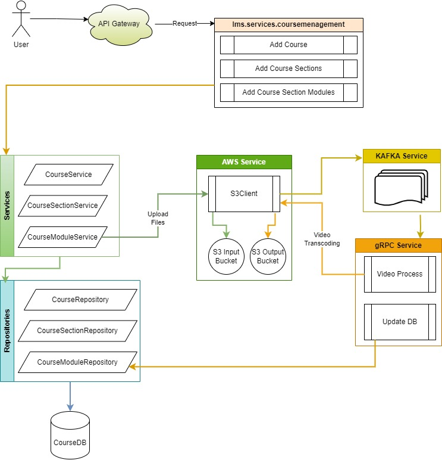

# eLearningManagementSystem

## lms.services

### lms.services.usermanagement

> Database

` Add-Migration InitialCreate -Project lms.shared.data StartupProject lms.services.usermanagement -Context UserDbContext`

### lms.services.coursemanagement

> Database

`Add-Migration InitialCreate -Project lms.shared.data  StartupProject lms.services.coursemanagement -Context CourseDbContext `

> Component Flow Diagram

